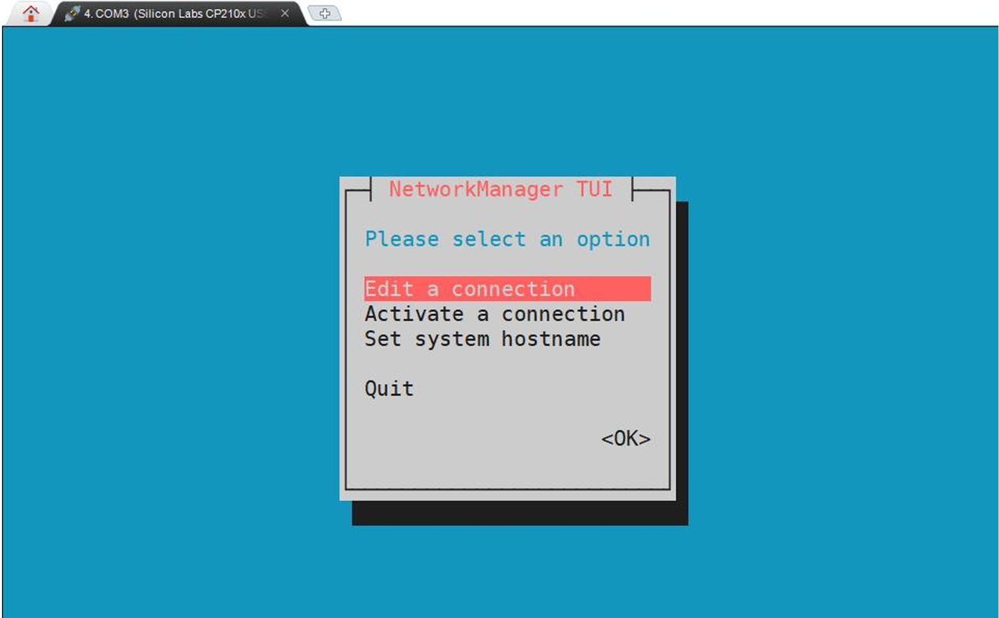
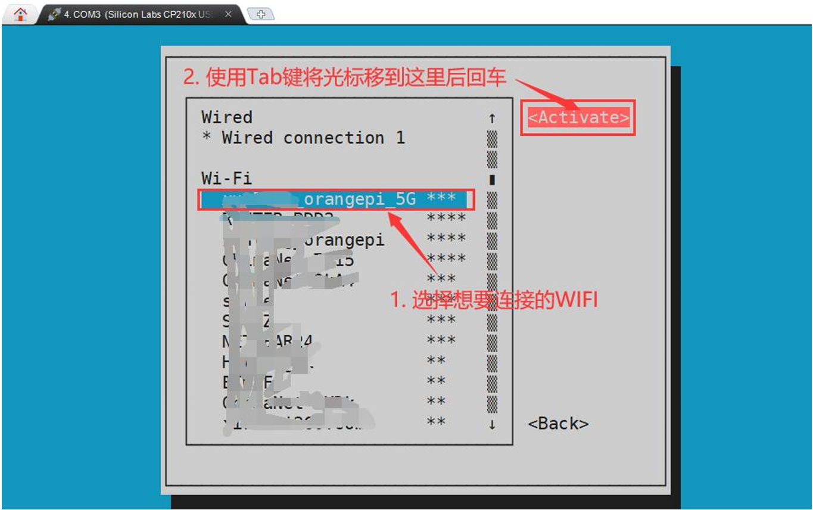
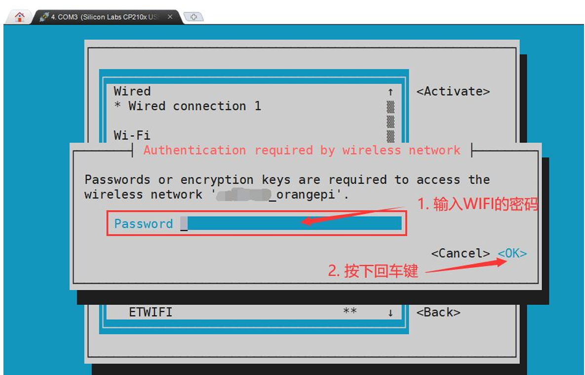
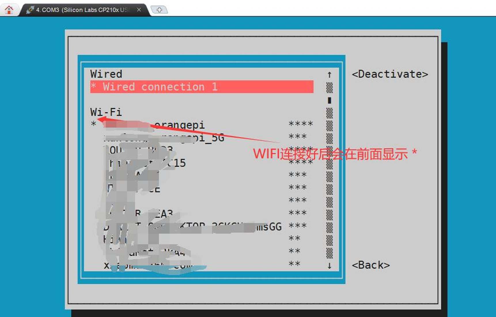
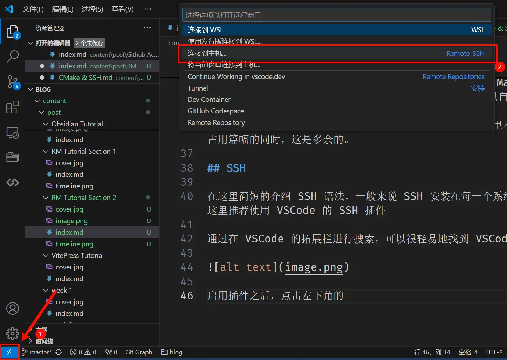
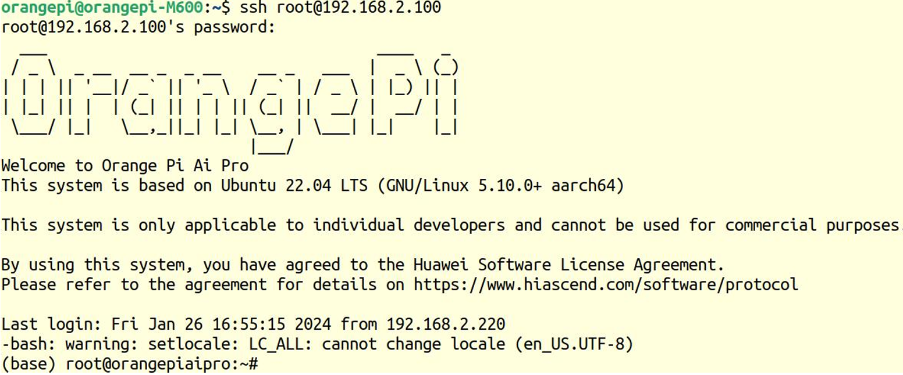

# 前言

RoboCup 3D识别运行在嵌入式计算平台上，而这些平台几乎全部使用 Linux 系统。Linux 的优势在于它提供了稳定的服务器环境、成熟的开发工具链以及完整的网络能力，使得多机器人系统可以在同一套软件框架下运行。

在我们的 RoboCup3D 项目中，开发板实际上就是一台小型服务器。所有视觉算法、机器人决策程序、深度学习模型推理程序都会运行在这个系统中。因此，成员需要具备基本的 Linux 操作能力，包括远程连接、文件管理、程序编译和调试。

Linux 与 Windows 的最大区别在于，Linux 更强调命令行操作和远程管理。你并不需要在开发板上接显示器和键盘，而是可以通过自己的电脑远程控制开发板。这也是服务器开发的标准模式。

# OrangePi

## 开始之前检查硬件

在使用之前确保板子已经正常启动。要确认以下几件事。

香橙派已经正确接上电源。注意官方手册明确说明，板子上虽然有三个 Type-C 接口，但只有靠近 PWM 风扇接口的那个是 PD 电源口，另外两个不能给开发板供电，接错后会表现为板子不开机或异常启动。

## 连接Wifi

在命令行中输入nmtui命令打开wifi连接的界面。

```bash
(base) HwHiAiUser@orangepiaipro-20t:~$ sudo nmtui
```

输入nmtui命令打开的界面如下所示



选择`Activate a connect`后回车，然后就能看到所有搜索到的WIFI热点


选择想要连接的WIFI热点后再使用Tab键将光标定位到`Activate`后回车



然后会弹出输入密码的对话框，在Password内输入对应的密码然后回车就会开始连接WIFI



WIFI连接成功后会在已连接的WIFI名称前显示一个“\*”



使用ping命令可以测试wifi网络的连通性，ping命令可以通过Ctrl+C快捷键
来中断运行

```bash
(base) HwHiAiUser@orangepiaipro-20t:~$ ping www.orangepi.org -I wlan0
PING www.orangepi.org (123.57.147.237) from 10.31.2.93 wlan0: 56(84) bytes of data.
64 bytes from 123.57.147.237 (123.57.147.237): icmp_seq=1 ttl=53 time=47.1 ms
64 bytes from 123.57.147.237 (123.57.147.237): icmp_seq=2 ttl=53 time=44.3 ms
64 bytes from 123.57.147.237 (123.57.147.237): icmp_seq=3 ttl=53 time=45.0 ms
64 bytes from 123.57.147.237 (123.57.147.237): icmp_seq=4 ttl=53 time=71.0 ms
^C--- www.orangepi.org ping statistics--
4 packets transmitted, 4 received, 0% packet loss, time 3002ms
rtt min/avg/max/mdev = 44.377/51.902/71.082/11.119 ms
```

## 查询ip地址

在终端输入如下命令，可以查询当前wifi的ip地址，这条命令的作用是查看当前这台机器所有网络接口的信息。

```bash
ip a s wlan 0
```

运行结果如下，屏幕会出来很多内容，不需要全部看懂，只需要盯住含有 inet 的那一行。

```bash
(base) HwHiAiUser@orangepiaipro-20t:~$ ip a s wlan0
4: wlan0: <BROADCAST,MULTICAST,UP,LOWER_UP> mtu 1500 qdisc mq state UP
group default qlen 1000
  link/ether 54:f2:9f:7b:ba:36 brd ff:ff:ff:ff:ff:ff
  inet 10.31.2.93/16 brd 10.31.255.255 scope global dynamic noprefixroute wlan0
    valid_lft 43003sec preferred_lft 43003sec
  inet6 fe80::5297:7036:a33c:bb93/64 scope link noprefixroute
    valid_lft forever preferred_lft forever
```

真正重要的是

```bash
10.31.2.93
```

这就是香橙派当前在局域网中的 IPv4 地址。后面的 `/16` 不是地址本体，SSH 的时候不要把 `/16` 一起带上。除了 `ip a`，也可以在图形界面里看地址

在 Ubuntu 桌面右上角通常有网络图标。点击后进入网络设置，在有线网络或无线网络的详细信息里，通常能看到 IPv4 地址。这个地址和 `ip a` 查到的本质上是同一个东西。

# 安装VSCode

通过 Ubuntu 自带的火狐浏览器找到熟悉的 [VSCode](https://code.visualstudio.com/) 的官网，并且进行安装。

选择`.deb` 进行下载，下载完毕之后进入下载文件夹，应该可以看到下载的 deb 包，右键在终端中打开，输入：

```bash
sudo dpkg -i code_your_version.deb
```

其中 `code_your_version.deb` 为你的 deb 包的名字，在命令行中可以使用 TAB 进行自动补全，这样你就只需要输入一个 code，之后进行自动补全即可。

输入密码，其中密码的输入是不可见的，输入之后终端没有反应并非你没有输入，输入之后按下回车即可。

稍等片刻，等命令行又一次可以输入的时候，在命令行中输入 code，回车，进入 VSCode。

# SSH

在这里简短的介绍 SSH 语法，一般来说 SSH 安装在每一个系统中，无需额外的安装，在这里推荐使用 VSCode 的 SSH 插件

通过在 VSCode 的拓展栏进行搜索，可以很轻易地找到 VSCode 的 SSH 插件：


启用插件之后，点击左下角的打开远程窗口，选择连接到主机即可：



输入（下面是示例命令，不要直接照抄）

```bash
ssh username@192.168.1.XXX
```

输入香橙派账号默认密码`Mind@123`。连接成功后打开远程终端，执行并检查是否连接成功

> 注意，输入密码的时候，屏幕上是不会显示输入的密码的具体内容的，请不要
> 以为是有什么故障，输入完后直接回车即可

成功登录系统后的显示如下图所示



连接成功后建议执行以下命令，确认系统正常。

```bash
pwd
whoami
hostname
```

- `pwd`:查看当前路径
- `whoami`:查看当前用户
- `hostname`:查看主机名

如果这些命令能正常运行，恭喜你，说明 SSH 连接已经成功。

# Linux

使用 SSH 后，我们会进入正式的 Linux 系统中，同时，由于使用 SSH，此时的 Linux 并没有提供图形化界面（这也是 Linux 最原始的形态），因此在本章节中，我们会首先讲解一些基础的 Linux 指令，以便读者可以进行接下来的操作：

- `ls`：可以展示当前目录下的文件内容，其中显示隐藏内容需要使用 `ls -a`。
- `cd`：用法为 `cd folder`，可以前往指定的文件夹中，需要注明的是，.. 为上级目录，如想要前往上级，使用 `cd ..`，上级的上级，以此类推 `cd ../..`。

文档的编辑操作需要使用 vim，这一技巧具备一定的难度，读者请勿尝试指令 `vim filename`，若无法退出，请狂点 `esc` 之后依次按下 :, `w, q, !, Enter` 以保存并退出，若不希望保存，无需按下 `w`。

# Anaconda

由于香橙派已经内置了Anaconda环境，因此读者无需自行安装。在这章，我们会讲解一些常用的`Conda`命令和包管理技巧。

## 查看已有环境

首先可以查看当前系统中已有的 conda 环境。

在终端输入：

```bash
conda env list
```

或者

```bash
conda info --envs
```

运行结果类似

```bash
# conda environments:
#
base                  *  /home/root/anaconda3
robocup                  /home/root/anaconda3/envs/robocup
```

## 激活环境

如果需要进入某个环境，可以使用：

```bash
conda activate 环境名
```

例如：

```bash
conda activate robocup
```

进入环境后，终端前面通常会显示环境名称，例如：

```bash
(robocup) root@orangepiaipro-20t
```

这说明当前已经进入 `robocup` 环境。

如果想返回默认环境：

```bash
conda activate base
```

或者

```bash
conda deactivate
```

## 创建新的环境

如果需要为某个项目创建独立环境，可以使用：

```bash
conda create -n 环境名 python=版本
```

例如：

```bash
conda create -n vision python=3.10
```

创建完成后可以使用：

```bash
conda activate vision
```

进入该环境。

使用独立环境的好处是：不同项目可以使用不同版本的 Python 并且不同项目之间不会产生依赖冲突，此外，将环境隔离会让环境更容易管理。

## 安装 Python 包

在 conda 环境中安装 Python 包通常有两种方式。

第一种：使用 conda 安装

```bash
conda install numpy
```

第二种：使用 pip 安装

```bash
pip install numpy
```

一般来说：常见科学计算库推荐使用 `conda install`，但是一些 Python 库只能通过 `pip install` 安装

## 查看已安装的包

查看当前环境已经安装的包：

```bash
conda list
```

会列出所有 Python 库以及对应版本。

## 更新包

更新某个 Python 包：

```bash
conda update 包名
```

例如：

```bash
conda update numpy
```

## 导出环境

有时需要把当前环境分享给其他队员，可以导出环境配置。

```bash
conda env export > environment.yml
```

生成的 `environment.yml` 文件记录了当前环境的所有依赖。

其他人可以使用：

```bash
conda env create -f environment.yml
```

快速创建完全相同的环境。
